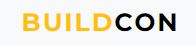
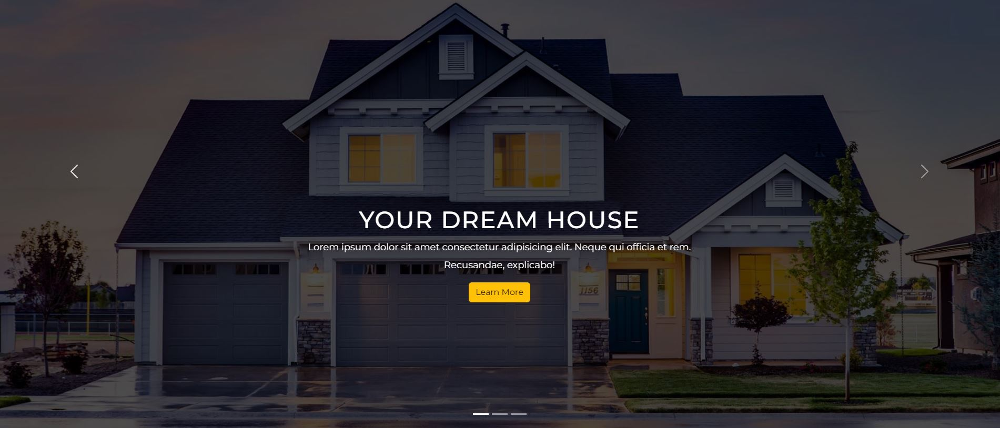
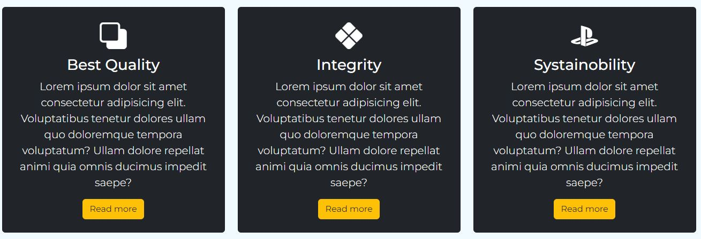
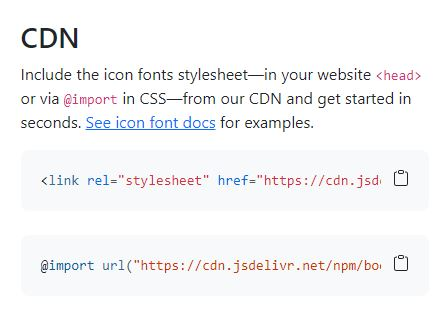

# Landing page site youtube with Bootstrap 5
Ссылка на урок на ютубе [Landing page design bootstrap 5](https://www.youtube.com/watch?v=DFUT5s5SasA)
Результат созданной страницы можно посмотреть [здесь](https://gorbunova89.github.io/Landingpage-building/)
>Верстка страницы выполнена с помощью фреймворка bootstrap 5.
### Структура страницы
* Навигационная панель `navbar`
* Секция 1 карусель `carousel`
* Секция 2 `card` с описанием **about**
* Секция 3 `card` сервисов **services**
* Секция 4 `card` проэктов **portfolio**
* Секция 5 `card` с командой **our team**
* Секция 6 `form` для обратной связи **contact**
* Футер `footer`
### Для создания данной страницы были использованы следующие линки:
* [stylesheet bootstrap](https://getbootstrap.com/docs/5.2/getting-started/introduction/) подключаем в `head`
* [Google fonts](https://fonts.google.com/specimen/Montserrat) подключаем в `head`
* [Icons](https://cdn.jsdelivr.net/npm/bootstrap-icons@1.10.2/font/bootstrap-icons.css>) подключаем в `head`
* [Script](https://getbootstrap.com/docs/5.2/getting-started/introduction/) подключаем в `body`
### Детали
1. Выделение части слова желтым цветом в название бренда `navbar-brand` было сделано с помощью команды `span`  и класса `text-warning` в html

2. Затемнение фона в карусели было сделано с помощью команды 

```css
carousel-inner::before background: rgba(0, 0, 0, 0.7);
``` 

в css
 
3. Иконочный шрифт вставляем из самого bootstrap, переходим во кладку **Icons**, спускаемся в с самый низ, копируем `link` в графе **CDN**, вставляем в `head`, используем код с тэгом `i`
 
4. Круглые фото создаем с помощью класса `rounded-circle` в html
```css
 
```                            
5. Адаптация под разную ширину экрана.
5.1 Делаем нижний отступ от секций и карточек.
5.2 Делаем ширину картинки 100%.
5.3 Делаем ширину текста 100%.
```css
@media only screen and (min-width: 768px) and (max-width: 991px) {
    .carousel-caption {
        bottom: 370px;
    }
    .carousel-caption p {
        width: 100%;
    }
    .card {
        margin-bottom: 30px;
    }
    .img-area img {
        width: 100%;
    }
}
```